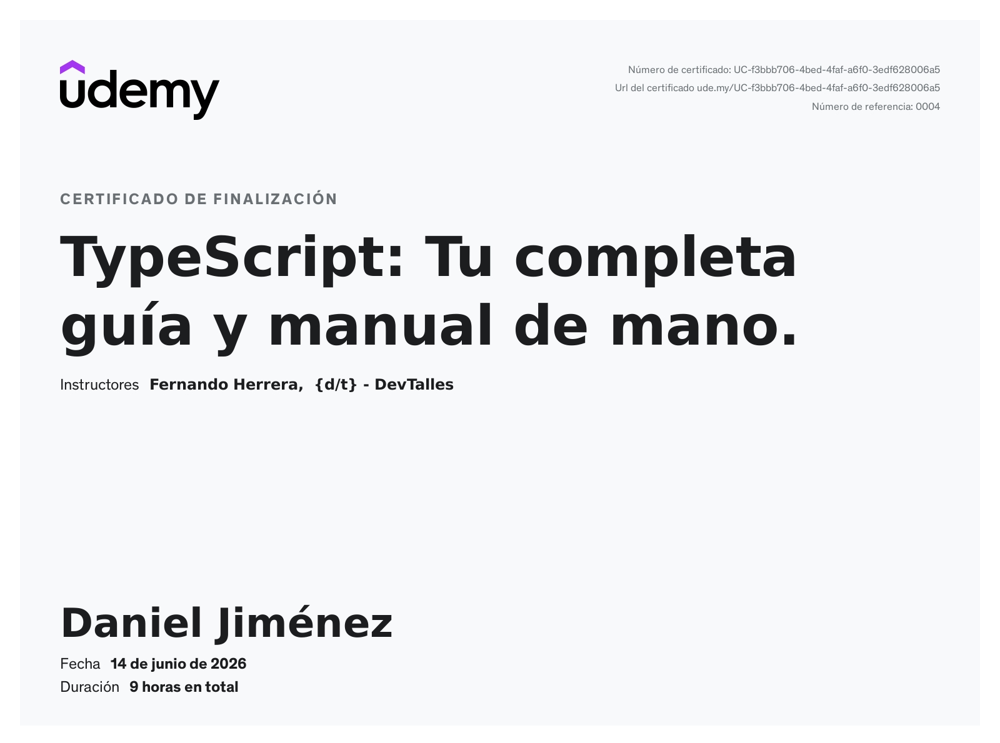

# Repositorio de Estudios de TypeScript

¡Bienvenido! Este repositorio centraliza todos mis apuntes, ejercicios y ejemplos de código realizados durante mi proceso de estudio y aprendizaje de **TypeScript**.

Mi estrategia es consolidar el material de diferentes cursos y fuentes en un solo lugar, manteniendo los proyectos más grandes y aplicaciones en repositorios separados.

---

## Acerca de mi

| Contacto                                                                                                                                        | Licencia                                                                                                                                |
| :---------------------------------------------------------------------------------------------------------------------------------------------- | :-------------------------------------------------------------------------------------------------------------------------------------- |
|  |  |

---

## 🛠️ Tecnologías y Herramientas Usadas

Este repositorio se enfoca en el estudio de las siguientes tecnologías:

---

## 📚 Estructura y Contenido Principal

El repositorio está organizado en dos secciones principales: **Cursos Completados** y **Archivos de Referencia**.

### 1. Cursos y Ejercicios (Carpetas)

| Curso/Fuente                                                                                                                                             | Ubicación                | Descripción                                                                                                                                  | Certificado |
| :------------------------------------------------------------------------------------------------------------------------------------------------------- | :----------------------- | :------------------------------------------------------------------------------------------------------------------------------------------- | :---------- |
| **CódigoFacilito**                                                                                                                                       | `codigofacilito/`        | Contiene los ejercicios y ejemplos del curso de TypeScript de CódigoFacilito. Enfocado en las bases del lenguaje y la configuración inicial. |  |
| **Udemy (Fernando Herrera)**  | `udemy/FernandoHerrera/` | Archivos desarrollados durante el curso de Udemy impartido por Fernando Herrera. Profundiza en aspectos avanzados y casos de uso comunes.    |  |

### 2. Archivos de Referencia (Documentación Clave)

Estos archivos actúan como una guía rápida y un resumen de las herramientas esenciales para trabajar con TypeScript.

| Archivo                                | Contenido                                                                                                                | Estado   |
| :------------------------------------- | :----------------------------------------------------------------------------------------------------------------------- | :------- |
| [`comandos.md`](./comandos.md)         | Resumen de los comandos más utilizados del compilador de TypeScript (`tsc`).                                             | ✅ Listo |
| [`tsconfig.md`](./tsconfig.md)         | Explicación de las configuraciones más importantes dentro del archivo de configuración del compilador (`tsconfig.json`). | ✅ Listo |
| [`package.json.md`](./package.json.md) | Guía sobre cómo utilizar el archivo `package.json` para definir _scripts_ de compilación y automatización.               | ✅ Listo |

---
